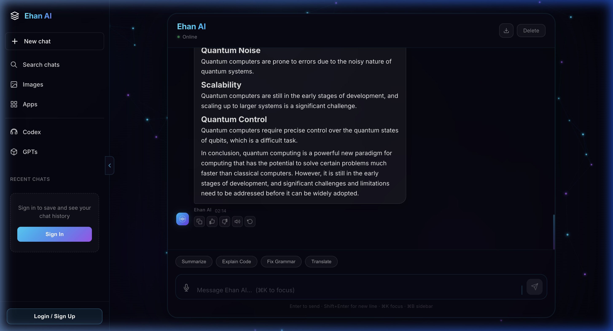

<div align="center">

# ⚡ Ehan AI — Full-Stack AI Chatbot

A production-ready AI chatbot with **multi-provider fallback**, real-time streaming, RAG-powered knowledge retrieval, and a stunning neural-animated UI.

[](https://chat-ui-lake-nu.vercel.app)
[](https://ehan-ai-backend.onrender.com/health)
[](LICENSE)



</div>

---

## ✨ Features

### 🤖 AI & Intelligence
- **Multi-provider cascade** — Gemini → Groq → G4F (never goes offline)
- **RAG pipeline** — FAISS vector DB + live web search + weather API for context-aware answers
- **Real-time SSE streaming** — tokens appear word-by-word as the AI thinks
- **Response caching** — identical questions return instantly
- **Stop generation** — cancel any response mid-stream

### 💬 Chat Experience
- **Markdown rendering** — bold, lists, tables, blockquotes, inline code
- **Syntax-highlighted code blocks** — with one-click copy per block
- **Reasoning process** — expandable thought process for complex queries
- **Voice input** — browser-native speech recognition
- **Read aloud** — text-to-speech for AI responses
- **Quick actions** — Summarize, Explain Code, Fix Grammar, Translate
- **Chat export** — download as Markdown or plain text
- **Reactions** — thumbs up/down feedback on responses
- **Chat history** — Firebase + localStorage persistence

### 🎨 Design
- **Neural network background** — interactive canvas particle animation
- **Glassmorphism UI** — modern dark theme with frosted-glass effects
- **Keyboard shortcuts** — `⌘K` focus, `Enter` send, `Shift+Enter` newline, `⌘B` sidebar
- **Fully responsive** — desktop, tablet, and mobile

---

## 🏗️ Architecture

```
┌──────────────────────────────────────────────────────────┐
│                      FRONTENDS                           │
│                                                          │
│  ┌──────────────────┐    ┌────────────────────────────┐  │
│  │  Next.js Client  │    │  Vite + React Chat UI      │  │
│  │  (next-client/)  │    │  (frontend/chat-ui/)       │  │
│  │  Port: 3000      │    │  Port: 5173                │  │
│  └────────┬─────────┘    └──────────┬─────────────────┘  │
│           │                         │                    │
└───────────┼─────────────────────────┼────────────────────┘
            │      POST /chat/stream  │
            ▼                         ▼
┌──────────────────────────────────────────────────────────┐
│                      BACKENDS                            │
│                                                          │
│  ┌──────────────────────────────────────────────────┐    │
│  │  Node.js/Express Backend (node-backend/)         │    │
│  │  • Gemini → Groq provider cascade                │    │
│  │  • Unified SSE streaming                         │    │
│  │  • MongoDB persistence (optional)                │    │
│  │  • Port: 8000                                    │    │
│  └──────────────────────────────────────────────────┘    │
│                                                          │
│  ┌──────────────────────────────────────────────────┐    │
│  │  Python/FastAPI Backend (backend/)               │    │
│  │  • Full RAG pipeline (FAISS + Web Search)        │    │
│  │  • Gemini → OpenAI → Groq → G4F cascade         │    │
│  │  • Weather + News context                        │    │
│  │  • Port: 8000                                    │    │
│  └──────────────────────────────────────────────────┘    │
└──────────────────────────────────────────────────────────┘
```

---

## 🧰 Tech Stack

| Layer | Technology |
|-------|-----------|
| **Primary Frontend** | React 19, Vite, react-markdown, react-syntax-highlighter, Firebase Auth |
| **Alt Frontend** | Next.js 15, Tailwind CSS v4, TypeScript |
| **Node Backend** | Express, TypeScript, @google/generative-ai, Mongoose |
| **Python Backend** | FastAPI, LangChain, FAISS, sentence-transformers, httpx |
| **AI Providers** | Google Gemini 2.0 Flash · Groq (Llama 3.3 70B) · G4F fallback |
| **Database** | MongoDB Atlas (optional) · Firebase Firestore |
| **Deployment** | Vercel (frontend) · Render (backend) |

---

## 📁 Project Structure

```
ai-chatbot/
├── frontend/chat-ui/          # ⭐ Primary React + Vite frontend
│   ├── src/
│   │   ├── Chat.jsx           # Main chat component (1200+ LOC)
│   │   ├── NeuralBackground.jsx  # Canvas neural animation
│   │   ├── Auth.jsx           # Firebase authentication modal
│   │   ├── Login.jsx          # Standalone login page
│   │   ├── firebase.js        # Firebase config
│   │   ├── App.jsx            # Root with auth routing
│   │   └── App.css            # Complete design system
│   ├── api/chat/stream.js     # Vercel Edge Function (serverless backend)
│   ├── vercel.json            # Vercel routing config
│   └── .env.example           # Environment template
│
├── next-client/               # Alternative Next.js frontend
│   ├── src/app/page.tsx       # Chat page with Tailwind
│   ├── src/hooks/useStreaming.ts  # SSE streaming hook
│   └── src/components/Sidebar.tsx
│
├── node-backend/              # Node.js/Express backend
│   ├── src/
│   │   ├── index.ts           # Express server entry
│   │   ├── controllers/chat.controller.ts  # Gemini → Groq cascade
│   │   ├── routes/chat.routes.ts
│   │   └── models/Conversation.ts
│   └── .env.example           # Environment template
│
├── backend/                   # Python/FastAPI RAG backend
│   ├── main.py                # FastAPI server with full provider cascade
│   ├── rag/
│   │   ├── vector_db.py       # FAISS vector store
│   │   ├── orchestrator.py    # RAG context orchestration
│   │   ├── search.py          # DuckDuckGo web search
│   │   ├── scraper.py         # Web content scraper
│   │   └── scheduler.py       # Background tasks
│   ├── requirements.txt
│   └── .env.example           # Environment template
│
├── vercel.json                # Root Vercel deployment config
├── render.yaml                # Render deployment config (both backends)
└── README.md
```

---

## 🚀 Quick Start

### Prerequisites
- **Node.js** 18+ and **npm**
- **Python** 3.11+ (only if using RAG backend)
- At least one AI API key (Gemini or Groq — both are free)

### Get Your API Keys (Free)

| Provider | Get Key | Free Tier |
|----------|---------|-----------|
| **Google Gemini** | [aistudio.google.com/apikey](https://aistudio.google.com/apikey) | 15 RPM, 1M tokens/day |
| **Groq** | [console.groq.com](https://console.groq.com) | 30 RPM, 6K tokens/min |

### 1. Clone & Setup

```bash
git clone https://github.com/Dev-anxit/ai-chatbot.git
cd ai-chatbot
```

### 2. Start the Backend (Node.js — recommended)

```bash
cd node-backend
npm install
cp .env.example .env
# Edit .env and add your GEMINI_API_KEY and/or GROQ_API_KEY
npx ts-node src/index.ts
```

The backend starts at `http://localhost:8000`

### 3. Start the Frontend

```bash
cd frontend/chat-ui
npm install
cp .env.example .env
# Edit .env — set VITE_API_BASE="http://localhost:8000"
npm run dev
```

The frontend starts at `http://localhost:5173` — open it and start chatting! 🎉

### Alternative: Python RAG Backend

For the full RAG pipeline with vector search and web context:

```bash
cd backend
python3 -m venv venv
source venv/bin/activate
pip install -r requirements.txt
cp .env.example .env
# Edit .env and add your API keys
uvicorn main:app --reload --port 8000
```

---

## 🌐 Deployment

### Frontend → Vercel

1. Go to [vercel.com](https://vercel.com) → **New Project**
2. Import the `Dev-anxit/ai-chatbot` GitHub repo
3. Vercel auto-detects the config from `vercel.json`
4. Add environment variables in Vercel dashboard:

| Variable | Value |
|----------|-------|
| `VITE_API_BASE` | Your backend URL (e.g. `https://ehan-ai-backend.onrender.com`) |
| `GEMINI_API_KEY` | Your Gemini key (for the Edge Function) |
| `GROQ_API_KEY` | Your Groq key (for the Edge Function) |
| `VITE_FIREBASE_*` | Firebase config values (for auth) |

5. Deploy! ✅

### Backend → Render

1. Go to [render.com](https://render.com) → **New Web Service**
2. Connect the `Dev-anxit/ai-chatbot` GitHub repo
3. Render auto-detects `render.yaml` — choose either the Python or Node service
4. Add your API keys as environment variables in the Render dashboard
5. Deploy! ✅

---

## 📡 API Reference

### `POST /chat/stream`

Streams an AI response via Server-Sent Events (SSE).

**Request (Vite frontend format):**
```json
{
  "message": "Explain quantum computing",
  "history": [
    { "role": "user", "content": "Hi" },
    { "role": "bot", "content": "Hello! How can I help?" }
  ]
}
```

**Request (Next.js frontend format):**
```json
{
  "messages": [
    { "role": "user", "content": "Hi" },
    { "role": "model", "content": "Hello!" },
    { "role": "user", "content": "Explain quantum computing" }
  ]
}
```

**SSE Response Stream:**
```
data: {"delta": "Quantum "}
data: {"delta": "computing "}
data: {"delta": "is a "}
...
data: [DONE]
```

### `GET /health`
```json
{
  "status": "live",
  "engine": "Gemini Pro Node",
  "geminiKey": "configured"
}
```

---

## 🔑 Environment Variables

### Backend (`node-backend/.env`)

| Variable | Required | Description |
|----------|----------|-------------|
| `GEMINI_API_KEY` | ✅ | Google Gemini API key — [get one here](https://aistudio.google.com/apikey) |
| `GROQ_API_KEY` | Recommended | Groq API key (fallback) — [get one here](https://console.groq.com) |
| `PORT` | Optional | Server port (default: `8000`) |
| `MONGODB_URI` | Optional | MongoDB connection string for chat persistence |

### Frontend (`frontend/chat-ui/.env`)

| Variable | Required | Description |
|----------|----------|-------------|
| `VITE_API_BASE` | ✅ | Backend URL — `http://localhost:8000` for dev |
| `VITE_FIREBASE_*` | Optional | Firebase config for authentication |

### Python Backend (`backend/.env`)

| Variable | Required | Description |
|----------|----------|-------------|
| `GEMINI_API_KEY` | ✅ | Google Gemini API key |
| `GROQ_API_KEY` | Recommended | Groq fallback key |
| `OPENAI_API_KEY` | Optional | OpenAI key for additional fallback |
| `NEWSAPI_KEY` | Optional | For real-time news context |

---

## 🔄 Provider Cascade

The system ensures **maximum uptime** by cascading through multiple AI providers:

```
Gemini 2.0 Flash → Gemini 2.0 Flash Lite → Gemini 1.5 Flash
    ↓ (if all fail)
Groq Llama 3.3 70B → Groq Llama 3.1 8B
    ↓ (if all fail)
G4F Community Providers (Python backend only)
    ↓ (if all fail)
Friendly error message to user
```

If one provider hits rate limits (429) or errors, the system automatically tries the next one. No downtime.

---

## 📜 License

[MIT](LICENSE) — build whatever you want with it.

---

<div align="center">

**Built with ❤️ by [Dev-anxit](https://github.com/Dev-anxit)**

⭐ Star this repo if you found it useful!

</div>
